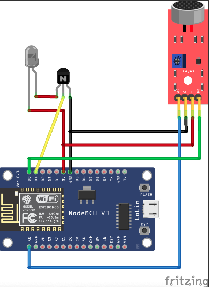

# PixMob Music Rhythm

Sync your PixMob wristbands with the music :notes: :sound: :dancer: using an esp3266 controller.

- The IR codes used in this project were obtained from:  [https://github.com/danielweidman/flipper-pixmob-ir-codes.](https://github.com/danielweidman/flipper-pixmob-ir-codes.)

https://user-images.githubusercontent.com/1235287/204122329-c0079990-3263-4185-87a6-407cd7c081b8.mp4

## Components :white_check_mark:

 - KY-038 Sensor.
 - IR LED Emitter.
 - BC547 Transistor.
 - NodeMCU Board (ESP8266).
 
 
## Instructions :page_facing_up:

1. Assemble the components as shown in the diagram.
2. Load 'pixmob-music-rhythm/pixmob-music-rhythm.ino'
in the NodeMCU Board (ESP8266) using arduino IDE.

### Note :pushpin:
Make sure the KY-038 sensor is calibrated.

## Authors

- [@drneox](https://www.github.com/drneox)

